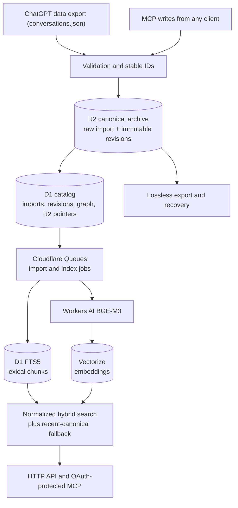

# MemPersist

Long-term memory for AI conversations, running entirely on Cloudflare. Original ChatGPT
exports and normalized conversation graphs live in R2, a D1 catalog makes them queryable,
lexical and semantic indexes stay disposable, and MCP exposes compact retrieval plus
intentional writes.

|                  |                                                                   |
| ---------------- | ----------------------------------------------------------------- |
| **MCP endpoint** | `https://mempersist.codifiedtech.id/mcp`                          |
| **Registry**     | `io.github.ravhirizaldi/mempersist` — version `1.0.1`             |
| **Runtime**      | Workers, D1, R2, Queues, Workers AI (BGE-M3), Vectorize, OAuth KV |
| **Protocol**     | MCP v2 over stateless Streamable HTTP, OAuth 2.1 with PKCE S256   |
| **Scope**        | Single-operator V1, one Worker, one TypeScript package            |

**What it does.** Preserves every uploaded ChatGPT export byte-for-byte, normalizes branches
and node metadata into revision-pinned canonical JSONL, indexes derived FTS and vector data,
and answers search, context, and batch reads with deterministic IDs. Writes are intentional,
revision-checked, and durable before indexing is queued.

**What it refuses to do.** It does not intercept ChatGPT traffic, extract replacement "facts",
summarize with a model, or treat any index as canonical. No billing, organizations, or
speculative multi-tenancy; no Durable Objects, Workflows, cron triggers, or containers. Deleting
every chunk, FTS row, and vector does not delete memory. "Unlimited" means no application-level
message quota — Cloudflare limits and billing still apply.

## Architecture



Two ingestion paths, and they stay independent: the ChatGPT data export parser accepts the native
`conversations.json` format only, while writes arrive through MCP from whichever client the caller
uses. Both converge on the same canonical revision model, so a memory created by a tool call and
one imported from an export are read, pinned, and restored identically.

R2 is the source of truth. A canonical write completes before its index job is queued, and an
indexing failure never reports that durable memory was lost. Rebuilds read R2, so an export
never needs to be uploaded twice. Full detail in [ARCHITECTURE.md](ARCHITECTURE.md) and
[docs/storage-and-indexing.md](docs/storage-and-indexing.md).

## Quickstart

```bash
yarn install
cp .dev.vars.example .dev.vars   # set a long random MEMORY_API_TOKEN
yarn types:bindings
yarn db:migrate:local
yarn dev
```

Requires WSL2/Linux, Node.js 22+, Yarn 1.22, and Wrangler 4.x authenticated with
`yarn wrangler whoami`. Use Yarn only. Local D1, R2, KV, and Queues are simulated; Workers AI and
Vectorize point at real remote bindings in the main configuration, while unit and integration
tests never call remote AI.

## Connect any MCP client

MemPersist is a standard remote MCP server: stateless Streamable HTTP at
`https://mempersist.codifiedtech.id/mcp`, OAuth 2.1 authorization code with PKCE S256, scope
`memory`. Nothing in the endpoint is client-specific — the same handshake, tool contracts, and
server instructions serve every caller. Point a client at the URL and it works:

| Client                                    | How to add it                                                                                                          |
| ----------------------------------------- | ---------------------------------------------------------------------------------------------------------------------- |
| Claude Code                               | `claude mcp add --transport http mempersist https://mempersist.codifiedtech.id/mcp`, then finish the email prompt      |
| Codex CLI, ChatGPT desktop, IDE extension | `~/.codex/config.toml` (or project `.codex/config.toml`), then `codex mcp login mempersist`                            |
| Cursor, Claude Desktop, VS Code, Zed      | add the URL as a remote (HTTP) MCP server in the client's MCP settings; the client starts the OAuth flow               |
| ChatGPT                                   | Developer mode, then add the URL as a custom MCP app                                                                   |
| MCP Inspector, custom SDK clients         | `npx @modelcontextprotocol/inspector`, or the official SDK client; use the URL and either OAuth or the developer token |
| stdio-only clients                        | keep the server remote and bridge stdio to HTTP with an OAuth-capable proxy; MemPersist itself never needs `npx`       |

Codex configuration:

```toml
[mcp_servers.mempersist]
type = "remote"
url = "https://mempersist.codifiedtech.id/mcp"
# auth = "oauth" is the default; run `codex mcp login mempersist` to authorize
```

The client discovers OAuth from the `401` challenge, opens the consent page, and stores the issued
access and refresh tokens. The consent page takes an email and sends a single-use, 15-minute magic
link through the `EMAIL` binding; the connection completes only after that link is opened, and an
existing email reconnects to its archive. The single scope is `memory`, and the sender address is
configuration (`AUTH_EMAIL_FROM`, `LEGACY_AUTH_EMAIL_FROM`), not part of the API contract. Never
paste `MEMORY_API_TOKEN` into a connector.

Already-configured connections keep working across upgrades without re-authorization; the legacy
hostname stays supported, and moving one client to the primary hostname costs exactly one new
authorization.

### Developer token

Scripts, the CLI, and non-interactive automation may send
`Authorization: Bearer <MEMORY_API_TOKEN>` instead of OAuth, which always maps to the owner
archive. Every account may own multiple namespaces; the same namespace name in two accounts is
separate data, and a supplied `namespace` is honored only when the caller owns it.

### Local, without deploying

The MCP audience is deployment configuration, so point a development server at itself:

```bash
yarn dev --local --port 8787 --local-protocol https \
  --var MCP_ORIGIN_OVERRIDE:https://127.0.0.1:8787
```

Discovery, consent, and token audiences then use `https://127.0.0.1:8787`, and both the
`.dev.vars` developer token and the full OAuth flow work. Local `send_email` writes each magic
link to `.wrangler/tmp/email/<id>/email-text/`. See
[docs/development.md](docs/development.md).

## Tools

24 tools, each carrying a human-readable title and read-only or destructive annotations. Retrieve
first, then expand only what you selected.

### Read

| Tool                           | Title                 | Notes                                                                                                                           |
| ------------------------------ | --------------------- | ------------------------------------------------------------------------------------------------------------------------------- |
| `memory_search`                | Search memories       | Hybrid search, 1–20 references; filters and opaque cursor pagination                                                            |
| `memory_get_context`           | Get memory context    | Canonical messages around one result chunk, up to 10 each way                                                                   |
| `memory_get_conversation`      | Get conversation      | Page one conversation's active timeline or full graph                                                                           |
| `memory_get_messages`          | Get messages          | Exact source-node or optional keyed lookup, revision-pinned, ordered batch with opaque cursor and byte budget                   |
| `memory_get_conversations`     | Get conversations     | Revision-pinned batch read of 1–20 conversations, cursor-paged                                                                  |
| `memory_list_conversations`    | List conversations    | Metadata and tags only, no bodies                                                                                               |
| `memory_list_revisions`        | List revisions        | Immutable revision history, newest first                                                                                        |
| `memory_resolve_conversations` | Resolve conversations | Exact-title lookup, no semantic search                                                                                          |
| `memory_list_namespaces`       | List namespaces       | Owned namespaces with conversation counts                                                                                       |
| `memory_stats`                 | Get memory statistics | Per-namespace counts and indexing health                                                                                        |
| `memory_import_status`         | Get import status     | Import progress, duplicate, or failure                                                                                          |
| `memory_get_capabilities`      | Get capabilities      | The deployed contract: versions, limits, per-tool bounds, and `message_keys` / `atomic_multi_conversation_commit` feature flags |

`memory_get_messages` accepts 1–100 ordered selectors. Each selector names a
`conversation_id`, optionally pins a `revision_id`, and uses exactly one of
`source_node_id` (up to 200 characters) or the forward-compatible `message_key`
(1–128 lowercase ASCII letters, digits, `.`, `_`, `/`, or `-`, starting and ending
with a letter or digit). Omitted revisions pin each conversation's current head
before any canonical R2 body is loaded; canonical loads are deduplicated by
unique pinned revision, while duplicate selectors retain duplicate ordered results.
The read-only lookup does not use FTS or Vectorize. Missing, foreign, deleted, or
unknown conversations, revisions, nodes, and keys share the same bounded
`NOT_FOUND` result. Duplicate canonical message keys return a bounded
canonical-storage error and are never resolved by choosing one. Whole messages
are admitted within the 32 KiB default, 4 KiB minimum, and 48 KiB maximum
serialized budgets; an oversized message is not truncated and returns only
bounded identity/byte diagnostics. Continuations
use an opaque, HMAC-signed, tenant-bound cursor that preserves selector order and
revision pins.

The optional `message_key` selector reads keyed fields written by `memory_upsert_messages` (and
any canonical data that carries them). `memory_upsert_messages` is the stable-key writer for
logical records; its contract is documented in the Write section below.

### Context assembly

| Tool                   | Title                | Notes                                                                                                                           |
| ---------------------- | -------------------- | ------------------------------------------------------------------------------------------------------------------------------- |
| `memory_build_context` | Build memory context | Deterministic, revision-pinned pack from 1–20 required conversations, optional hybrid evidence, explicit token and byte budgets |

### Write

Each write returns a bounded durable receipt with separate indexing and verification status, and
accepts `verify: true` to reload the committed R2 revision. `memory_commit_batch` applies 1–20
append or complete-replace operations across distinct conversations in one same-account atomic
commit; every operation supplies an explicit `base_revision_id`.

`memory_upsert_messages` accepts 1–100 unique keyed text messages for one owned conversation. Every
request requires `base_revision_id` and a role; keys are exact 1–128-character lowercase ASCII
strings matching `[a-z0-9._/-]`, starting and ending with a letter or digit. Existing keys replace
text while preserving source identity, role, creation time, graph, and metadata; a role mismatch is
rejected. Missing keys append in request order with server identity and timestamps. All entries are
validated before one atomic revision is committed. An all-unchanged request returns `no_change`
without a revision or index job; mixed inserts, updates, and unchanged entries create one revision.
`verify: true` checks the committed canonical revision and reports per-key results in the durable
receipt; indexing starts only after a successful head transition.
The deployed capability response advertises `features.message_keys: true`.

Batch replay with the same idempotency key and material returns the existing result without duplicate
revisions or jobs. Changed material under a used key conflicts, and a stale operation prevents every
operation in that batch from committing. Owned namespaces may be mixed in one batch; accounts
remain isolated.

| Tool                        | Title                   | Notes                                                                     |
| --------------------------- | ----------------------- | ------------------------------------------------------------------------- |
| `memory_store`              | Store memory            | New intentional memory; first write claims a namespace you name           |
| `memory_upsert_messages`    | Upsert keyed messages   | Atomic 1–100 insert/update/no-op by exact key; required base revision     |
| `memory_append`             | Append memory           | Continue a conversation with `base_revision_id`                           |
| `memory_replace`            | Replace memory          | Supersede with a complete transcript, preserving identity and tags        |
| `memory_commit_batch`       | Commit memory batch     | Atomically append/replace 1–20 conversations with explicit base revisions |
| `memory_edit_messages`      | Edit memory messages    | Edit 1–100 known source nodes in place; structured content is rejected    |
| `memory_restore_revision`   | Restore memory revision | Move the head back to a historical revision, no duplicate revision        |
| `memory_copy_conversations` | Copy conversations      | Lossless R2 copy into another owned namespace, idempotency-keyed          |
| `memory_update_tags`        | Update memory tags      | Add or remove tags under optimistic concurrency                           |

### Admin

| Tool                          | Title                | Notes                                                                   |
| ----------------------------- | -------------------- | ----------------------------------------------------------------------- |
| `memory_delete_conversations` | Delete conversations | Up to 100, canonical and derived data together after exact confirmation |
| `memory_empty_namespace`      | Empty namespace      | Bounded, resumable batch empty after exact confirmation                 |

Retry, reindex, and integrity commands stay HTTP/CLI only so a model cannot trigger expensive
maintenance. Full tool contracts, receipts, and batch semantics live in [docs/mcp.md](docs/mcp.md).

### Search pagination

The first `memory_search` call requires `query` and accepts `limit` (1–20, default 8), an optional
`namespace`, `tags`, `tag_mode` (`all` or `any`), and optional `max_serialized_bytes`. The byte
budget defaults to 32 KiB and accepts 4–48 KiB. A response may include `next_cursor`; continue
with that opaque cursor, the next `limit`, and the byte budget. Do not resubmit the query or change
filters on a continuation.

Compatibility responses that do not request pagination may omit the pagination-only metadata.

Search cursors identify a short-lived, tenant-bound snapshot. The snapshot preserves the exact
ranking, scores, and order from the first call, pins each result's revision, and carries the
original `degraded` and `unavailable` diagnostics forward. Its metadata reports the ranking
version, candidate count and cap, creation and expiry times, and bounded omission counts/reasons.
Expired cursors are cleaned up when read. Malformed, forged, expired, incompatible, or
cross-account cursors return a bounded validation error; cursors expose no internal storage or
account identifiers.

Search is scoped to the authenticated account. A namespace filter is valid only for a namespace
the account owns; omitting it searches the account's owned namespaces. Deleted, stale, or no-longer
owned snapshot candidates are omitted with safe bounded diagnostics rather than replacing the
snapshot or exposing another account's data. Search cursors are for MCP/HTTP search pagination
only; they are not export or canonical-read cursors.

## Limits

`memory_get_capabilities` is the single contract: it reports the constants the transports
enforce, so a quoted figure cannot drift from its enforcement. Deployed values:

| Limit                                       | Value                                 |
| ------------------------------------------- | ------------------------------------- |
| MCP tool output guard                       | 65,536 bytes (64 KiB)                 |
| Recommended tool output / receipt ceiling   | 49,152 bytes (48 KiB)                 |
| Inline JSON write on both transports        | 1,048,576 bytes (1 MiB)               |
| Direct import body, and each multipart part | 16,777,216 bytes (16 MiB)             |
| Single message content                      | 1,000,000 characters                  |
| Batch conversation read response            | 32 KiB default, 48 KiB max            |
| Search response                             | 32 KiB default, 4 KiB min, 48 KiB max |
| Exact message lookup response               | 32 KiB default, 4 KiB min, 48 KiB max |

Aggregate limits are the UTF-8 bytes of the complete serialized request, measured before any
canonical work. An oversized request writes nothing and fails with
`REQUEST_TOO_LARGE` (`retryable: false`) plus a conservative `suggested_max_items` estimate —
never a silent truncation.

## ChatGPT import

Export your data from ChatGPT, extract `conversations.json`, then:

```bash
MEMPERSIST_URL=http://localhost:8787 \
MEMPERSIST_TOKEN='your-token' \
yarn import:chatgpt /path/to/conversations.json

MEMPERSIST_TOKEN='your-token' yarn import:status <import-id>
```

The uploaded bytes are stored unchanged and hashed server-side; exact duplicates are marked
`duplicate` and never reprocessed. One queue turn processes 25 conversations from an ordinal
checkpoint, so retries are safe and resumable. Larger files use R2 multipart upload. Unknown
fields, alternate branches, and graph anomalies stay recoverable. See
[docs/chatgpt-import.md](docs/chatgpt-import.md).

## Dashboard

Open `/login` for passwordless access to the server-rendered dashboard: archive totals, the
deterministic memory map, revision-pinned canonical reading, display-name editing, and a streamed
lossless export. Namespace emptying runs asynchronously; account deletion has a seven-day
cancelable grace period and makes writes read-only while pending. No frontend framework or extra
Cloudflare resource is required. See [docs/dashboard.md](docs/dashboard.md) and
[ADR 0028](docs/adr/0028-passwordless-dashboard-export-and-deletion.md).

The public site, OAuth pages, and magic-link email are available in English and Bahasa Indonesia;
API, MCP, and CLI contracts remain English.

## Development

```bash
yarn verify
```

Runs formatting, the binding-type freshness check, lint, strict TypeScript for the Worker and the
`web/mindmap/` browser project, the memory-map bundle check, unit and MCP tests,
Workers-runtime D1/R2 integration tests, and a Wrangler deploy dry run. Nothing deploys unless
`yarn deploy` is invoked. After editing anything under `web/mindmap/`, run `yarn build:mindmap` so
the generated bundle matches its sources.

```bash
yarn admin search 'api.internal.example'   # CLI search against canonical data
yarn retry <job-id>                        # re-run a failed import or index job
yarn reindex                               # rebuild derived indexes from R2
yarn verify:integrity                      # check catalog, R2 pointers, and revision hashes
```

Schema changes are numbered SQL migrations applied through Wrangler, never edited after they are
applied. Architecture changes require an ADR in [docs/adr/](docs/adr/). See
[CONTRIBUTING.md](CONTRIBUTING.md) and [AGENTS.md](AGENTS.md) before opening a pull request.

## Documentation

| Document                                                                                               | Contents                                                          |
| ------------------------------------------------------------------------------------------------------ | ----------------------------------------------------------------- |
| [ARCHITECTURE.md](ARCHITECTURE.md)                                                                     | System shape, canonical versus derived, write order, retrieval    |
| [CONTRIBUTING.md](CONTRIBUTING.md)                                                                     | Setup, per-change requirements, tests, authorization gates        |
| [SECURITY.md](SECURITY.md)                                                                             | Threat model, trust boundaries, limits, rotation, reporting       |
| [docs/mcp.md](docs/mcp.md)                                                                             | Tool contracts, receipts, batches, capabilities, rejection shapes |
| [docs/development.md](docs/development.md)                                                             | Local loop, local MCP clients, browser pages, memory map client   |
| [docs/deployment.md](docs/deployment.md)                                                               | Provisioning, migration, deploy, post-deploy checks               |
| [docs/cloudflare-resources.md](docs/cloudflare-resources.md)                                           | Required resources and manual provisioning steps                  |
| [docs/chatgpt-import.md](docs/chatgpt-import.md)                                                       | Import guarantees, upload paths, parser ceilings                  |
| [docs/dashboard.md](docs/dashboard.md)                                                                 | Dashboard, export, and deletion flows                             |
| [docs/storage-and-indexing.md](docs/storage-and-indexing.md)                                           | Canonical storage layout and index generations                    |
| [docs/operations-and-recovery.md](docs/operations-and-recovery.md)                                     | Recovery procedures and deletion-job re-enqueue                   |
| [docs/rp-workflow.md](docs/rp-workflow.md)                                                             | Reviewable runtime-rule workflow                                  |
| [docs/adr/](docs/adr/)                                                                                 | Decision log, newest first                                        |
| [docs/adr/0040-atomic-multi-conversation-commit.md](docs/adr/0040-atomic-multi-conversation-commit.md) | Atomic multi-conversation commits, replay, recovery               |
